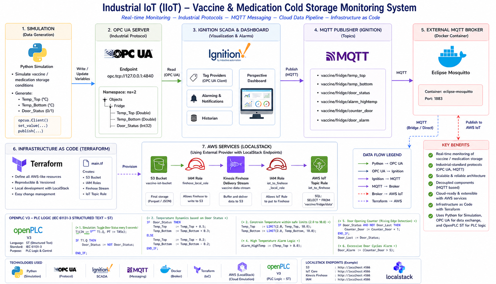

#  Pipeline de Données IoT pour la Chaîne du Froid (Vaccins)

Ce projet propose une solution technologique innovante pour répondre aux défis critiques de la logistique pharmaceutique, en alliant l'automatisation industrielle (IIoT) et la puissance du Cloud AWS.

  
<b>Click to view detailed Architecture Diagram</b>

   
  

## Problématique : Le Risque Thermique
Dans l'industrie pharmaceutique, la **chaîne du froid** est vitale. Une simple variation de température non détectée peut rendre des lots entiers de vaccins inutilisables, entraînant :
* **Pertes financières** massives.
* **Risques sanitaires** majeurs pour les patients.
* **Non-conformité** aux réglementations strictes (comme celles de la FDA ou de l'EMA).

---

##  La Solution : Surveillance Intelligente & Cloud
Pour résoudre ce problème, j'ai conçu une architecture intégrée qui garantit une visibilité totale et une optimisation des coûts :

1.  **Collecte en Temps Réel (IIoT) :** Utilisation des protocoles **OPC UA** et **OpenPLC** pour extraire les données de température directement des capteurs industriels.
2.  **Infrastructure Scalable (AWS) :** Déploiement automatisé via **Terraform** pour créer un pipeline de données sécurisé (Kinesis Firehose, S3).
3.  **Gouvernance Financière (FinOps) :** Intégration d'un script d'optimisation pour s'assurer que l'infrastructure cloud reste rentable et sans gaspillage.

---

##  Technologies Utilisées
* **Cloud :** AWS (EC2, S3, Firehose, IAM).
* **Infrastructure as Code :** Terraform.
* **Programmation :** Python (Boto3) pour l'automatisation.
* **Industriel :** OpenPLC, OPC UA.

---

## Optimisation FinOps (Le Plus de ce Projet)

Le script finops_optimizer.py apporte une couche de gouvernance intelligente en permettant de :

Surveiller l'utilisation du stockage S3 en calculant dynamiquement la taille des données capteurs collectées.

Alerter en cas de dépassement de seuil (100 Mo), évitant ainsi les coûts imprévus liés à l'accumulation de données IoT massives.

Promouvoir l'archivage stratégique, en recommandant le passage vers des classes de stockage moins coûteuses (comme S3 Glacier) pour les anciennes données.

Assurer une gestion proactive du budget Cloud, garantissant une infrastructure performante et économiquement optimisée.
